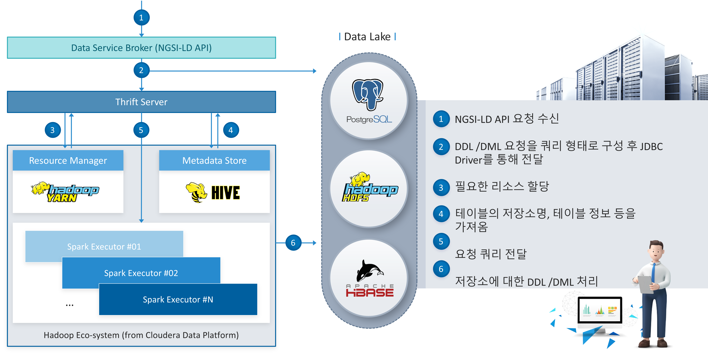

# 1. BigDataStorageHandler Overview

BigDataStorageHandler supports the ability to store / process / analyze the requested data loaded on the data hub platform. It also supports spatial computation and spatial indexing of spatial data with coordinate information, and provides spatial data storage / processing / analysis capabilities for big databases.

 

## 1.1. How BigdataStorageHandler works

BigDataStorageHandler is responsible for setting up the Spark Thrift Server(STS) which is responsible for the external SQL query requests related to big data from Data Service Broker. 
STS is defined as Hive Server2 or sometimes it also can be defined as Spark SQL port in HiveServer2 that allows JDBC/ODBC clients to execute SQL queries over JDBC and ODBC protocols on Apache Spark.

 

## 1.2. How Thrift server and Data Core are connected

Spark Thrift Server is connected to Data Service Broker in Data Core through JDBC and ODBC protocol.

 

